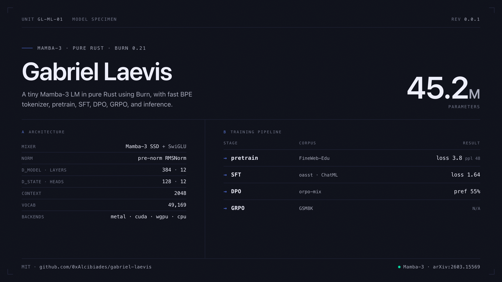

# Gabriel Laevis

[](https://github.com/0xAlcibiades/gabriel-laevis/actions/workflows/ci.yml)
[](LICENSE)



A **Mamba-3** small language model implemented from scratch in [Burn](https://burn.dev).

## Stack

- **Framework:** Burn 0.21
- **Backend:** cubecl depending on environment
- **Tokenizer:** fastokens with byte-level BPE
- **Architecture:** Mamba-3 (SISO) — Llama-style backbone, each block a Mamba-3 mixer plus a SwiGLU MLP, pre-norm RMSNorm, tied embeddings. Ref: [Mamba-3, arXiv:2603.15569](https://arxiv.org/abs/2603.15569).

## Status

A **45.2M**-parameter model trained end to end on a single M2 Ultra Mac Pro in about a day. It produces coherent, on-format chat: it adopts the assistant register and stops at the turn boundary.

Pretraining, SFT, DPO all saw gains. GRPO runs cleanly but does not move the needle at that scale. Verifiable grade-school math is reachable for a small model along the TinyGSM path instead which scales the verifier rather than the generator [8].

## Scaling

Dimensions are runtime config knobs, so doing a larger run is a config change away.Checkpointing and auto-resume are uniform across stages, long runs survive interruption.

## Usage

`train` trains the model, one stage per run; `serve` serves inference for a trained
model. Run either with `--help` for the full set of args.

| Command              | What it does                               |
| -------------------- | ------------------------------------------ |
| `train pretrain`     | Pretrain on FineWeb-Edu (next-token)       |
| `train sft`          | Instruction-tune (ChatML, response-masked) |
| `train dpo`          | Preference-optimize the SFT model          |
| `train grpo`         | RL on GSM8K with a verifiable reward       |
| `train all`          | Run all four stages in order               |
| `serve <checkpoint>` | OpenAI-compatible inference server         |

Each `train` stage continues from the prior stage's checkpoint and auto-resumes from
the latest, e.g.:

```sh
cargo run --profile=maxperf --features metal --bin train -- pretrain
cargo run --profile=maxperf --features metal --bin serve -- model
```

### Crate Features

When building either binary you should pick one backend feature i.e.
`ndarray`/`metal`/`wgpu`/`cuda`. And then if on a backend where its
supported you can use `bf16` to halve memory and compute for training.
Adding the `checkpoint` feature enables activation checkpointing,
which trades off a bit of memory for compute.

## License

MIT

## Resources

### Architecture & framework

- **Mamba-3** — the model architecture [1].
- **Burn / CubeCL** — Rust tensor + deep-learning framework and GPU kernel layer ([burn.dev](https://burn.dev), [tracel-ai/burn](https://github.com/tracel-ai/burn)).
- **fastokens** — byte-level BPE tokenizer ([crusoecloud/fastokens](https://github.com/crusoecloud/fastokens)).

### Tokenizer & LM reference

- **SmolLM2** — tokenizer and small-LM training reference [2] ([HuggingFaceTB/SmolLM2-135M](https://huggingface.co/HuggingFaceTB/SmolLM2-135M)).

### Data

- **Pretraining:** FineWeb-Edu [3] ([HuggingFaceFW/fineweb-edu](https://huggingface.co/datasets/HuggingFaceFW/fineweb-edu)).
- **Post-training (SFT):** instruction tuning on human-written OpenAssistant oasst_top1 ([OpenAssistant/oasst_top1_2023-08-25](https://huggingface.co/datasets/OpenAssistant/oasst_top1_2023-08-25)); preference data (DPO) from [mlabonne/orpo-dpo-mix-40k](https://huggingface.co/datasets/mlabonne/orpo-dpo-mix-40k-flat); RL (GRPO) on [openai/gsm8k](https://huggingface.co/datasets/openai/gsm8k). See mlabonne's [llm-datasets](https://github.com/mlabonne/llm-datasets) for the broader catalog.

### References

1. A. Lahoti, K. Y. Li, B. Chen, C. Wang, A. Bick, J. Z. Kolter, T. Dao, A. Gu. "Mamba-3: Improved Sequence Modeling using State Space Principles." arXiv:2603.15569, 2026.
2. L. Ben Allal, A. Lozhkov, E. Bakouch, et al. "SmolLM2: When Smol Goes Big — Data-Centric Training of a Small Language Model." arXiv:2502.02737, 2025.
3. G. Penedo, H. Kydlíček, L. Ben Allal, A. Lozhkov, M. Mitchell, C. Raffel, L. von Werra, T. Wolf. "The FineWeb Datasets: Decanting the Web for the Finest Text Data at Scale." arXiv:2406.17557, 2024.
4. T. Dao, A. Gu. "Transformers are SSMs: Generalized Models and Efficient Algorithms Through Structured State Space Duality." arXiv:2405.21060, 2024.
5. J. Su, Y. Lu, S. Pan, A. Murtadha, B. Wen, Y. Liu. "RoFormer: Enhanced Transformer with Rotary Position Embedding." arXiv:2104.09864, 2021.
6. N. Shazeer. "GLU Variants Improve Transformer." arXiv:2002.05202, 2020.
7. B. Zhang, R. Sennrich. "Root Mean Square Layer Normalization." arXiv:1910.07467, 2019.
8. B. Liu, S. Bubeck, R. Eldan, J. Kulkarni, Y. Li, A. Nguyen, R. Ward, Y. Zhang. "TinyGSM: achieving >80% on GSM8K with small language models." arXiv:2312.09241, 2023.
